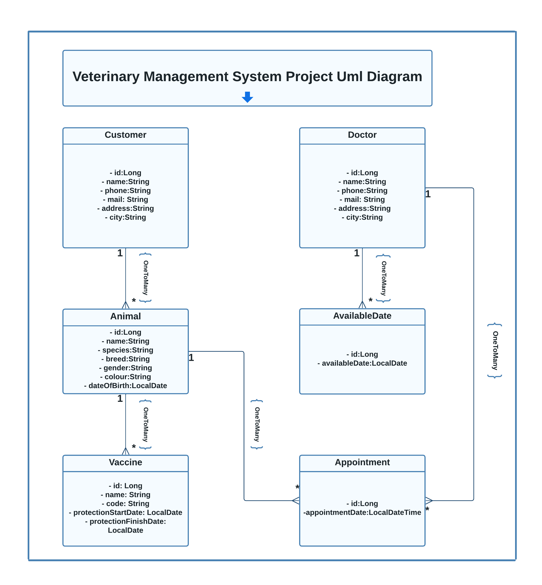

# Veterinary Clinic Management System API

### This project provides a RESTful API to manage daily operations of a veterinary clinic.

---

## Used technologies

<code></code>
<code></code>
<code></code>
<code></code>
<code></code>
<code></code>
<code></code>
<code></code>
<code></code>
<code></code>
<code></code>
<code></code>


---

## Features

### Animal and Owner Management

#### Animal Operations:

- **Manage Animals:** Perform operations like saving, updating, viewing, and deleting animals.
- **Filter Animals:** API endpoints are provided to list animals filtered by name.
- **List Animals by Owner:** A special API endpoint exists to list all animals based on owner information.

#### Owner Operations:

- **Manage Owners:** Operations such as saving, updating, viewing, and deleting owners can be performed.
- **Filter Owners:** API endpoints are provided to list owners filtered by name.

### Vaccination Management

#### Vaccination Operations:

- **Manage Vaccinations:** Perform operations like saving, updating, viewing, and deleting vaccinations applied to animals.
- **Check Expiry Dates:** Prevents entry of new vaccinations by checking the expiry dates of the same type of vaccinations.
- **List Vaccination Records:** An API endpoint is provided to list all vaccination records for a specific animal.
- **List Vaccinations within a Specific Date Range:** A special API endpoint allows listing vaccinations within a specific date range.

### Appointment Management

#### Appointment Operations:

- **Manage Appointments:** Create, update, view, and delete appointments for animal vaccinations and examinations.
- **Filter Appointments:** API endpoints are provided to filter appointments by date and time information.
- **Doctor Availability:** Only hourly appointments are allowed for each doctor, ensuring the doctor's availability and no other appointments at the specified time.

### Veterinary Doctor Management

#### Doctor Operations:

- **Manage Doctors:** Perform operations like saving, updating, viewing, and deleting veterinary doctors.

#### Availability Management:

- **Manage Availability:** Operations to add, update, view, and delete available days for doctors are implemented.
- **List Available Days:** The days a doctor works are stored in the system as LocalDate, and API endpoints are provided for users to access this information.

---

## Installation

You can follow these steps to use the project:

1. Clone the repository: `git clone https://github.com/PehlivanMert/Week-12.git`
2. Navigate to the project directory: `cd project-directory`
3. Install dependencies: Maven will automatically download the required dependencies.
4. VeterinaryManagementSystemDatabase.sql file is provided in the project. You can use this file to create the database and tables.
5. VeterinaryManagementSystem.postman_collection.json file is provided in the project. You can use this file to import the API endpoints to Postman.
6. Alternatively, the API can be used via Swagger. Go to http://localhost:8080/swagger-ui/index.html#/ in your browser.
7. Start the application: Run the main class `dev.patika.veterinarymanagementsystem.VeterinaryManagementSystemApplication` to start the application. 
8. Spring Boot will automatically start the application on port 8080.
9. Use the API endpoints to manage the veterinary clinic. 
10. You can also use the API documentation to understand the available endpoints and their usage.
11. Docker-compose.yml and Dockerfile is provided in the project. You can use this file to create a Docker image and run the application in a Docker container with PostgreSQL.
12. For Docker, you can use the following commands:
    - `docker-compose up` to create the Docker image and run the container.
    - `docker-compose up --build` to rebuild the image and run the container.
    - `docker-compose down` to stop the container and remove the image.
    - The application will be available at http://localhost:8080.
    - The PostgreSQL database will be available at http://localhost:5432.

---

## Contact

If you have any questions or feedback, please send an email to [pehlivanmert@outlook.com.tr](mailto:pehlivanmert@outlook.com.tr). Additionally, you can raise questions and provide feedback regarding the project on GitHub: [Project GitHub Page](https://github.com/PehlivanMert/Week-12/tree/main/VeterinaryManagementSystem)

---


## UML Diagram



---

# Veterinary Management System API Endpoints Documentation

This project contains a RESTful API that provides a veterinary clinic management system. Below is a list of all the endpoints that the API provides.

## Customers API

### 1. Save Customer

**Endpoint:** `POST /v1/customers`

**Description:** Creates a new customer record.

### 2. Customer Details

**Endpoint:** `GET /v1/customers/{id}`

**Description:** Retrieves the details of a specific customer.

### 3. Customer's Animals

**Endpoint:** `GET /v1/customers/{id}/animals`

**Description:** Retrieves the animals owned by a customer.

### 4. Search Customer by Name

**Endpoint:** `GET /v1/customers/byname/{name}`

**Description:** Searches for customers by name.

### 5. Paged Customer List

**Endpoint:** `GET /v1/customers`

**Description:** Retrieves a paged list of customers.

### 6. Update Customer

**Endpoint:** `PUT /v1/customers`

**Description:** Updates the details of a customer.

### 7. Delete Customer

**Endpoint:** `DELETE /v1/customers/{id}`

**Description:** Deletes a specific customer.


## Animals API

### 1. Save Animal

**Endpoint:** `POST /v1/animals`

**Description:** Creates a new animal record.

### 2. Animal Details

**Endpoint:** `GET /v1/animals/{id}`

**Description:** Retrieves the details of a specific animal.

### 3. Animal's Vaccines

**Endpoint:** `GET /v1/animals/{id}/vaccines`

**Description:** Retrieves the vaccination history of an animal.

### 4. Search Animal by Name

**Endpoint:** `GET /v1/animals/byname/{name}`

**Description:** Searches for animals by name.

### 5. Paged Animal List

**Endpoint:** `GET /v1/animals`

**Description:** Retrieves a paged list of animals.

### 6. Update Animal

**Endpoint:** `PUT /v1/animals`

**Description:** Updates the details of an animal.

### 7. Delete Animal

**Endpoint:** `DELETE /v1/animals/{id}`

**Description:** Deletes a specific animal.

## Appointments API

### 1. Save Appointment

**Endpoint:** `POST /v1/appointmentdates`

**Description:** Creates a new appointment record.

### 2. Appointment Details

**Endpoint:** `GET /v1/appointmentdates/{id}`

**Description:** Retrieves the details of a specific appointment.

### 3. Filter Appointments by Date and Doctor

**Endpoint:** `GET /v1/appointmentdates/filter-date-doctor`

**Description:** Filters appointments by a specific date range and a specific doctor.

### 4. Filter Appointments by Date and Animal

**Endpoint:** `GET /v1/appointmentdates/filter-date-animal`

**Description:** Filters appointments by a specific date range and a specific animal.

### 5. Paged Appointment List

**Endpoint:** `GET /v1/appointmentdates`

**Description:** Retrieves a paged list of appointments.

### 6. Update Appointment

**Endpoint:** `PUT /v1/appointmentdates`

**Description:** Updates the details of an appointment.

### 7. Delete Appointment

**Endpoint:** `DELETE /v1/appointmentdates/{id}`

**Description:** Deletes a specific appointment.

## Available Dates API

### 1. Save Available Date

**Endpoint:** `POST /v1/availabledates`

**Description:** Creates a new available date record.

### 2. Available Date Details

**Endpoint:** `GET /v1/availabledates/{id}`

**Description:** Retrieves the details of a specific available date.

### 3. Paged Available Date List

**Endpoint:** `GET /v1/availabledates`

**Description:** Retrieves a paged list of available dates.

### 4. Update Available Date

**Endpoint:** `PUT /v1/availabledates`

**Description:** Updates the details of an available date.

### 5. Delete Available Date

**Endpoint:** `DELETE /v1/availabledates/{id}`

**Description:** Deletes a specific available date.

## Doctors API

### 1. Save Doctor

**Endpoint:** `POST /v1/doctors`

**Description:** Creates a new doctor record.

### 2. Doctor Details

**Endpoint:** `GET /v1/doctors/{id}`

**Description:** Retrieves the details of a specific doctor.

### 3. Paged Doctor List

**Endpoint:** `GET /v1/doctors`

**Description:** Retrieves a paged list of doctors.

### 4. Update Doctor

**Endpoint:** `PUT /v1/doctors`

**Description:** Updates the details of a doctor.

### 5. Delete Doctor

**Endpoint:** `DELETE /v1/doctors/{id}`

**Description:** Deletes a specific doctor.

## Vaccines API

### 1. Save Vaccine

**Endpoint:** `POST /v1/vaccines`

**Description:** Creates a new vaccine record.

### 2. Vaccine Details

**Endpoint:** `GET /v1/vaccines/{id}`

**Description:** Retrieves the details of a specific vaccine.

### 3. Filter Vaccines by Expiry Date

**Endpoint:** `GET /v1/vaccines/protect`

**Description:** Filters vaccines by a specific expiry date range.

### 4. Paged Vaccine List

**Endpoint:** `GET /v1/vaccines`

**Description:** Retrieves a paged list of vaccines.

### 5. Update Vaccine

**Endpoint:** `PUT /v1/vaccines`

**Description:** Updates the details of a vaccine.

### 6. Delete Vaccine

**Endpoint:** `DELETE /v1/vaccines/{id}`

**Description:** Deletes a specific vaccine.
```

"The software will take us to the stars." 

```


